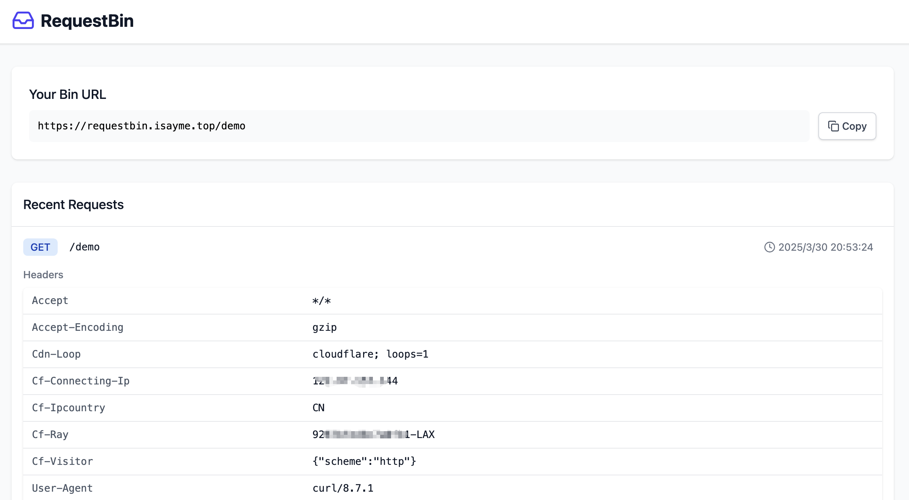

# RequestBin

A requestbin in Golang.

# Preview



# Usage

## config

config with yaml format:

```
http:
  port: 3000
logger:
  level: info
mongo:
  # mongodb to save requests
  uri: mongodb://127.0.0.1:27017/requestbin
```

## docker

`docker run -it --rm -p 3000:3000 -v /path/to/config.yaml:/etc/requestbin.yaml isayme/requestbin:latest`

## docker compose

```
services:
  requestbin:
    container_name: requestbin
    image: isayme/requestbin:latest
    ports:
      - 3000:3000
    volumes:
      - /path/to/config.yaml:/etc/requestbin.yaml
    restart: unless-stopped
```

## limit

1. show up to 100 requests, others will not reture;

## mongodb

create index with `expireAfterSeconds` option to auto delete saved requests.

```
db.requests.createIndex({ created: 1 }, { expireAfterSeconds: 86400 })
```
